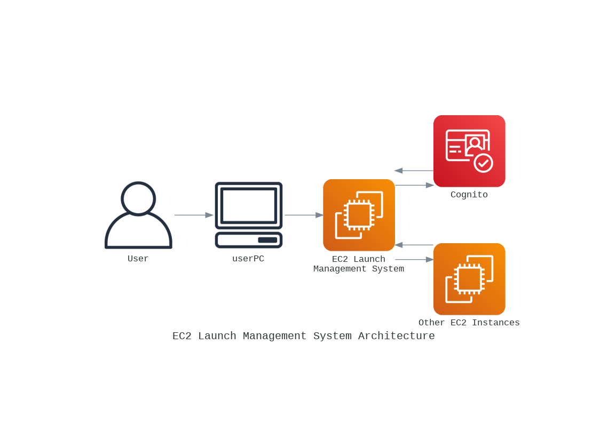
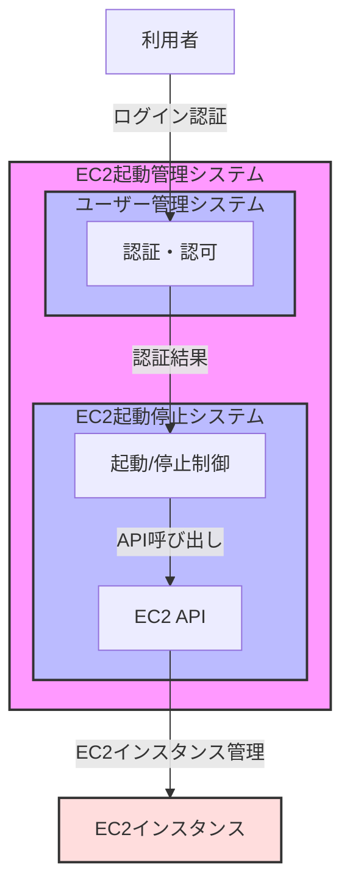

# システム構成図

## 1.インフラ設計



#### 出力コード(python diagrams)
```python
from diagrams import Diagram, Cluster
from diagrams.aws.compute import EC2
from diagrams.aws.security import Cognito
from diagrams.aws.general import User, Client

with Diagram("EC2 Launch Management System Architecture", show=False):
    user = User("User")
    userPC = Client("userPC")
    ec2_launch_manager = EC2("EC2 Launch\nManagement System")
    cognito = Cognito("Cognito")
    other_ec2 = EC2("Other EC2 Instances")

    user >> userPC >> ec2_launch_manager >> cognito
    ec2_launch_manager >> other_ec2
    cognito >> ec2_launch_manager
    other_ec2 >> ec2_launch_manager
```

## 2.サブシステム構成



