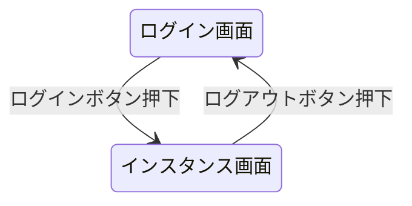
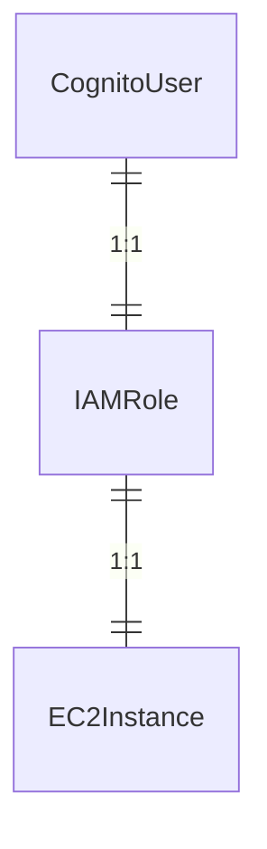

# 外部設計書

## 1. 概要
この設計書は、EC2起動管理システムの外部インターフェースおよびシステム構成を定義するものである。

## 2. システムの概要
このシステムは、ユーザーがAWSコンソールにアクセスせずにEC2インスタンスを管理（起動・停止）できるようにすることを目的としている。

## 3. 機能概要
本システムは以下の機能を提供する。

| No | 分類 | 機能名 | 機能説明 | 使用者 |
|-----------|-----------|-----------|-----------|-----------|
| 1    | EC2起動停止    | ログイン    | システムにログインして、利用者に紐づけられたEC2インスタンスが自動的に起動する。このとき、接続に必要なIPアドレスなども表示される。   | 利用者    |
| 2    | EC2起動停止    | ログアウト    | システムからログアウトして、利用者に紐づけられたEC2インスタンスが自動的に停止する。| 利用者    |

## 4.画面概要

### 4.1 画面一覧表

| No | 分類 | 画面名 | 機能No | 説明 |
|-----------|-----------|-----------|-----------|-----------|
| 1    | EC2起動管理    | ログイン画面    | 1  | ユーザーがメールアドレスとパスワードを入れてログインする画面    |
| 2    | EC2起動管理    | インスタンス画面    | 1  | 起動したインスタンスの接続情報(IPアドレス、DNS名、インスタンス名)を表示する画面    |

### 4.2 画面遷移図

- 矢印の名前はボタン名


## 5. システムアーキテクチャ

### 5.1 システムの構成
システムは以下のコンポーネントで構成される。

- コンポーネント1: フロントエンド（ユーザーインターフェース）
  - 説明: ユーザーがシステムとやり取りするためのインターフェース。HTML、CSS、JavaScript、Bootstrapなどを用いて構築される。
- コンポーネント2: バックエンド（サーバーサイド）
  - 説明: フロントエンドからのリクエストを処理し、ビジネスロジックを実行する。PHP言語で構築される。
- コンポーネント3: AWSサービス（EC2、IAM、Cognitoなど）
  - 説明: EC2インスタンスの起動・停止、認証・認可、セキュリティ管理などを担う。AWSの各種サービスを活用する。

### 5.2 アーキテクチャ図


#### 出力コード(python diagrams)
```python
from diagrams import Diagram
from diagrams.aws.compute import EC2
from diagrams.aws.security import Cognito, IdentityAndAccessManagementIam
from diagrams.onprem.client import User
from diagrams.onprem.compute import Server

with Diagram("EC2起動管理システムアーキテクチャ", show=False, direction="TB"):
    user = User("ユーザー")
    frontend = Server("フロントエンド")
    backend = Server("バックエンド")
    ec2 = EC2("EC2")
    cognito = Cognito("Cognito")
    iam = IdentityAndAccessManagementIam("IAM")

    user >> frontend >> backend >> ec2
    backend >> cognito
    backend >> iam
```

## 6. インターフェース仕様

### 6.1 ユーザーインターフェース
- 画面1: ログイン画面
  - 画面の説明: ユーザーがメールアドレスとパスワードを入力してログインする。正しい認証情報が入力されると、インスタンス画面に遷移する。
- 画面2: インスタンス画面
  - 画面の説明: ログイン後、ユーザーに紐づけられたEC2インスタンスの情報（IPアドレス、DNS名、インスタンス名など）を表示する。ログアウトボタンを押下すると、インスタンスが停止し、ログイン画面に戻る。

### 6.2 APIインターフェース
- API1: ログインAPI
  - APIの説明: ユーザーのメールアドレスとパスワードを受け取り、認証を行う。認証が成功すると、紐づけられたEC2インスタンスが起動し、その情報が返される。
- API2: ログアウトAPI
  - APIの説明: ユーザーがログアウトする際に呼び出される。紐づけられたEC2インスタンスが停止する。

### 6.3 外部システムとの連携
- 外部システム1: AWS EC2
  - 連携の説明: EC2インスタンスの起動、停止、情報取得などの操作を行うために、AWS EC2サービスと連携する。
- 外部システム2: AWS Cognito
  - 連携の説明: ユーザー認証・認可のために、AWS Cognitoサービスと連携する。


## 7.DB概要

### 7.1 使用するデータベース

- DBは使用しない

## 8. エンティティ概要



## 9. セキュリティ設計

### 9.1 認証・認可
- 認証メカニズム: AWS Cognito
- 認可メカニズム: AWS Cognito、IAMロール

### 9.2 暗号化
- 通信の暗号化: AWSとの通信は、AWS SDKを利用する。
- データの暗号化: パスワードハッシュ化して保存する。

## 10. 参照文献
- AWS公式ドキュメント

## 11. 修正履歴
| 日付       | バージョン | 説明         | 作成/修正者  |
|------------|------------|--------------|-------------|
| 2024-03-09 | 1.0        | 初版作成     | 後藤卓也  |
