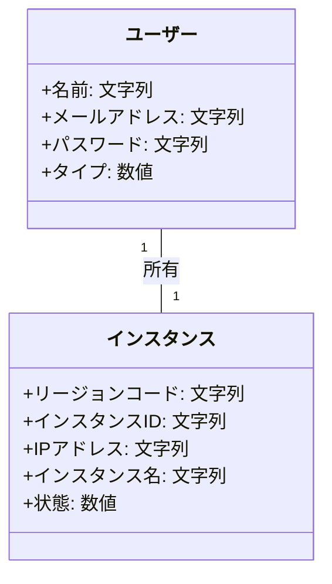
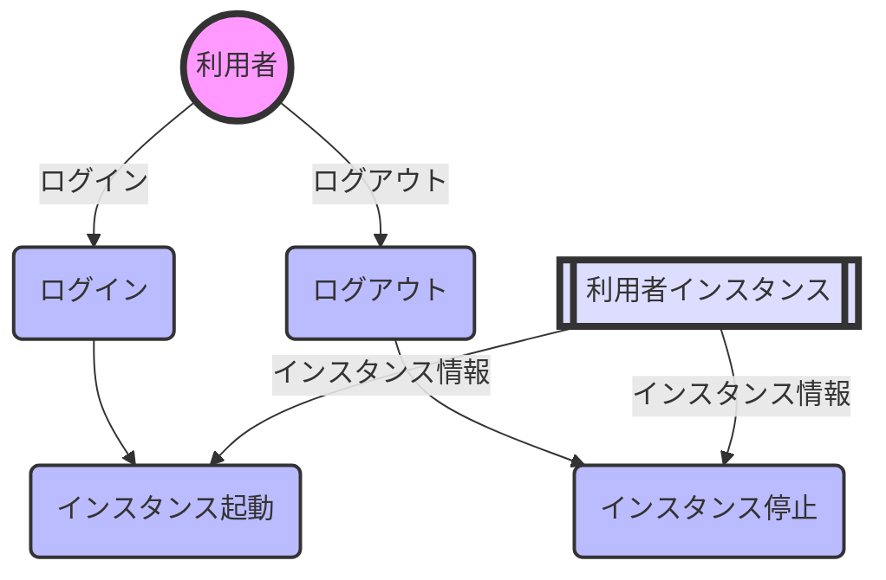
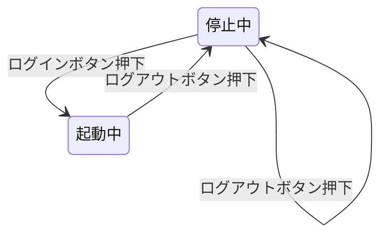

# 概念設計書

## 1.概念モデル

## 2.DFD(データフロー図)

## 3.状態遷移

### EC2インスタンスの状態遷移表

|  | ログインボタン押下 | ログアウトボタン押下 |
|-----------|-----------|-----------|
| 停止中    | 起動中 | 停止中 | 
| 起動中    | 　ー    | 停止中 |

### EC2インスタンスの状態遷移図

